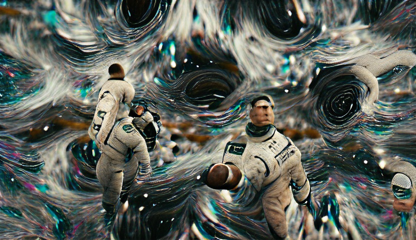

# Fractal Generator
## A real-time fractal world explorer

The Mandelbrot fractal is a mathematically generated psychedelic image that resembles itself across different scales. Zoom in and out on the fractal to explore it! You can gradually apply a maximum zoom of around 1:10^15 discovering countless fractal underworlds in the process.

A user interface gives you the ability to modify the fractal colors and apply configure the fractal generation method.

Fractal Zoom - generated in the application

## Meaty part

Algorithm to calculate a section of the fractal. Using intrinsics to utilize AVX2.

``
bool Fractal::calc_section_avx(char* data, const int width, const int iters, Colour rgb,
			       const Point2D pix_tl, const Point2D pix_br, const Point2D frac_tl,
			       const Point2D frac_br) noexcept
{
	const double scale_x = (frac_br.x - frac_tl.x) / (pix_br.x - pix_tl.x);
	const double scale_y = (frac_br.y - frac_tl.y) / (pix_br.y - pix_tl.y);

	double pos_y = frac_tl.y;
	int offset_y = 0;
	int x, y;

	/* ----------     ----------     ----------     ---------- */
	/* ----------            Intrinsics             ---------- */
	/* ----------     ----------     ----------     ---------- */
	// Double Registers
	__m256d _zr, _zi, _zr2, _zi2, _cr, _ci, _auxDouble1, _auxDouble2, _maskDouble;
	__m256d _two = _mm256_set1_pd(2.0), _four = _mm256_set1_pd(4.0);
	__m256d _xScale = _mm256_set1_pd(scale_x), _xSkip = _mm256_set1_pd(scale_x * 4);
	__m256d _xPos, _xPosOffset = _mm256_mul_pd(_mm256_set_pd(0, 1, 2, 3), _xScale);

	// Integer Registers
	__m256i _n, _maskInt, _auxInt;
	__m256i _one = _mm256_set1_epi64x(1), _iters = _mm256_set1_epi64x(iters);

	for (y = static_cast<int>(pix_tl.y); y < pix_br.y; ++y) {
		_auxDouble1 = _mm256_set1_pd(frac_tl.x);
		_xPos = _mm256_add_pd(_auxDouble1, _xPosOffset);
		_ci = _mm256_set1_pd(pos_y);

		for (x = static_cast<int>(pix_tl.x); x < pix_br.x; x += 4) {
			//std::complex<double> z{ 0.0, 0.0 };
			_zr = _mm256_setzero_pd();
			_zi = _mm256_setzero_pd();
			//std::complex<double> c{ pos_x, pos_y };
			_cr = _xPos;
			//int n{ 0 };
			_n = _mm256_setzero_si256();
			//while ()
		repeat:
			// z.real() = z.real() * z.real() - z.imag() * z.imag() + c.real()
			_zr2 = _mm256_mul_pd(_zr, _zr);
			_zi2 = _mm256_mul_pd(_zi, _zi);
			_auxDouble1 = _mm256_sub_pd(_zr2, _zi2);
			_auxDouble2 = _mm256_mul_pd(_zr, _zi);
			_zr = _mm256_add_pd(_auxDouble1, _cr);
			_zi = _mm256_fmadd_pd(_auxDouble2, _two, _ci);
			//  z.real() * z.real() + z.imag() * z.imag() < 4
			_auxDouble1 = _mm256_add_pd(_zr2, _zi2);
			_maskDouble = _mm256_cmp_pd(_auxDouble1, _four, _CMP_LT_OQ);
			// iters > n
			_maskInt = _mm256_cmpgt_epi64(_iters, _n);
			// (z.real() * z.real() + z.imag() * z.imag() < 4 && n < iters)
			_maskInt = _mm256_and_si256(_maskInt, _mm256_castpd_si256(_maskDouble));
			// ++n
			_auxInt = _mm256_and_si256(_one, _maskInt);
			_n = _mm256_add_epi64(_n, _auxInt);

			// if cond true true, keeps iterating
			if (_mm256_movemask_pd(_mm256_castsi256_pd(_maskInt)) > 0)
				goto repeat;

			_xPos = _mm256_add_pd(_xPos, _xSkip);

			/* ----------     ----------     ----------     ---------- */
			/* ----------        End of Intrinsics          ---------- */
			/* ----------     ----------     ----------     ---------- */
			char* pix = &data[3 * (offset_y + x)];

			for (int i = 3; i >= 0; --i) {
				// reg _n contains [pix3 n][pix2 n][pix1 n][pix0 n]
				const int n = static_cast<int>(int(_n.m256i_i64[i]));
				char r = 0, g = 0, b = 0;

				if (n < iters) {
					r = static_cast<char>(256 *
							      (0.5 * sin(0.1f * n + rgb.r) + 0.5));
					g = static_cast<char>(256 *
							      (0.2 * sin(0.1f * n + rgb.g) + 0.5));
					b = static_cast<char>(256 *
							      (0.5 * sin(0.1f * n + rgb.b) + 0.5));
				}
				pix[0] = r;
				pix[1] = g;
				pix[2] = b;
				pix += 3;
			}
		}
		pos_y += scale_y;
		offset_y += width;
	}
	return true;
}
``

## Getting Started

You can either clone the repository and generate the project with GenerateProject.bat or directly access the lastest binaries. 

*MOUSE WHEEL BUTTON* (click and drag) ----- move around the Fractal.  
*UP* and *DOWN* keys ----- zoom in and out.  
*LEFT* and *RIGHT* keys ----- decrease or increase the fractal detail level.  
*SPACEBAR* key ----- take a screenshot.  
*ESC* key ----- quit the application. 

Use *Settings* interface to play around with the colouring and other configurations. 

[Executable](https://github.com/ManuCanedo/fractal-generator/tree/master/bin)  
[Source Code](https://github.com/ManuCanedo/fractal-generator/tree/master/src)   
[Screenshots](https://github.com/ManuCanedo/fractal-generator/tree/master/screenshots) 

## Development Checklist

Engine progress:
+ **Application Engine** set up
+ (Dev Tool) Logger implemented  
+ (Dev Tool) Function Timer implemented
+ (Dev Tool) Project generation generation using Premake
+ (Dev Tool) Pixel Engine Integration
+ (Dev Tool) Memory Allocations tracker 
+ (Dev Tool) Using precompiled headers
+ Fractal algorithm **multithreading**
+ GLFW and OpenGL (GLEW) integration (Pixel Engine replaced)
+ Window Abstraction and **platform specific Window implementation** for Windows
+ Custom **Event Manager**
+ **ImGui** Layer Abstraction and platform specific implementation
+ Fractal Generation using **AVX2** CPU vector extensions (Compiler Intrinsics)
+ (Dev Tool) CPU SIMD Features inspector implemented  
  
  
Fractal application progress:
+ Bitmap Images Generation
+ **Mandelbrot Fractal Generation**
+ Histogram Colouring
+ Static zoom application
+ **Real Time Fractal Generation**
+ Real Time Sinusoidal Colouring
+ **Screenshots**
+ **UI** and fractal configuration in real time

## Stay in touch

+ Linkedin - https://www.linkedin.com/in/manuel-tabares/

 

    
    Interstellar - AI generated (vqgan+clip)

