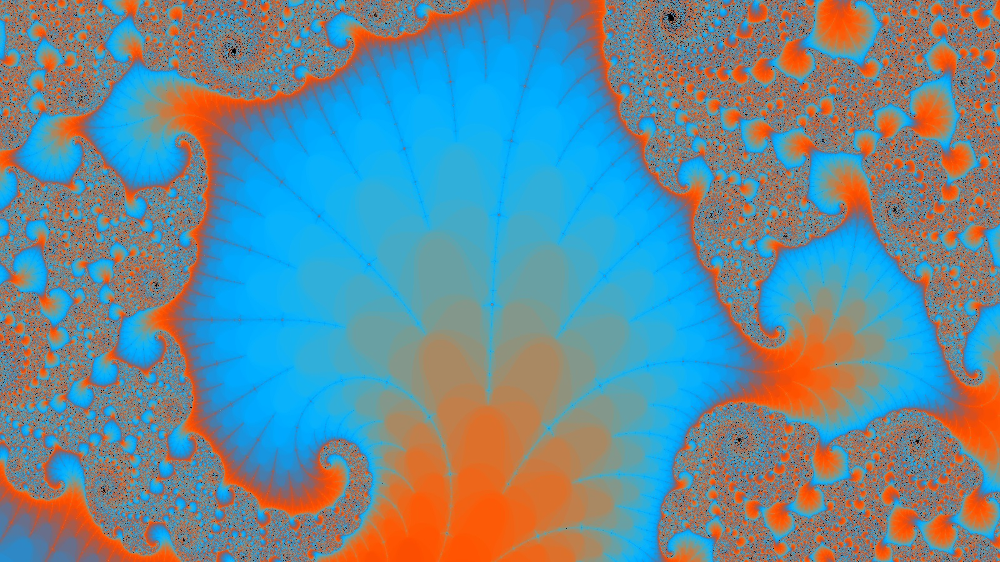

# Fractal Generator
## A real-time fractal world explorer

The Mandelbrot fractal is a mathematically generated psychedelic image that resembles itself across different scales. Zoom in and out on the fractal to explore it! You can gradually apply a maximum zoom of around 1:10^15 discovering countless fractal underworlds in the process.

A user interface gives you the ability to modify the fractal colors and apply configure the fractal generation method.

    
    Fractal Zoom - generated in the application

## Getting Started

You can either clone the repository and generate the project with GenerateProject.bat or directly access the lastest binaries. 

*MOUSE WHEEL BUTTON* (click and drag) ----- move around the Fractal.  
*UP* and *DOWN* keys ----- zoom in and out.  
*LEFT* and *RIGHT* keys ----- decrease or increase the fractal detail level.  
*SPACEBAR* key ----- take a screenshot.  
*ESC* key ----- quit the application. 

Use *Settings* interface to play around with the colouring and other configurations. 

[Executable](https://github.com/ManuCanedo/fractal-generator/tree/master/bin)  
[Source Code](https://github.com/ManuCanedo/fractal-generator/tree/master/src)   
[Screenshots](https://github.com/ManuCanedo/fractal-generator/tree/master/screenshots) 

## Development Checklist

Engine progress:
+ **Application Engine** set up
+ (Dev Tool) Logger implemented  
+ (Dev Tool) Function Timer implemented
+ (Dev Tool) Project generation generation using Premake
+ (Dev Tool) Pixel Engine Integration
+ (Dev Tool) Memory Allocations tracker 
+ (Dev Tool) Using precompiled headers
+ Fractal algorithm **multithreading**
+ GLFW and OpenGL (GLEW) integration (Pixel Engine replaced)
+ Window Abstraction and **platform specific Window implementation** for Windows
+ Custom **Event Manager**
+ **ImGui** Layer Abstraction and platform specific implementation
+ Fractal Generation using **AVX2** CPU vector extensions (Compiler Intrinsics)
+ (Dev Tool) CPU SIMD Features inspector implemented

Fractal application progress:
+ Bitmap Images Generation
+ **Mandelbrot Fractal Generation**
+ Histogram Colouring
+ Static zoom application
+ **Real Time Fractal Generation**
+ Real Time Sinusoidal Colouring
+ **Screenshots**
+ **UI** and fractal configuration in real time

## Stay in touch

+ Linkedin - https://www.linkedin.com/in/manuel-tabares/

 

    
    Interstellar - AI generated (vqgan+clip)

