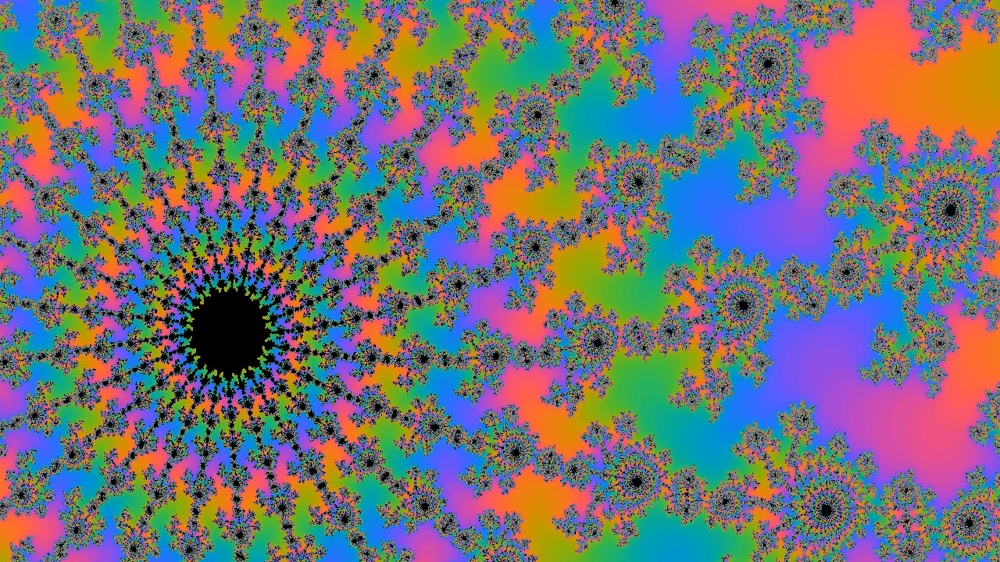

# Welcome to Fractal Generator - A real-time fractal world explorer

The Mandelbrot fractal is a psichodelic mathematically-generated image that is self-like through different scales. The user will be able to zoom in and out through the fractal in order to explore it. In the upcoming future the application will integrate a GUI that will provide the user with the possibility of modifying the colouring of the fractal and applying different presets. These presets will allow the user to visualize and compare the Time Complexity of some of the most popular computer science algorithms (e.g. binary search, euclidean algorithm, Huffman algorithm, Djiistra...).

## Getting Started

You can either clone the repository and generate the project with GenerateProject.bat or directly access the lastest binaries. 

Use UP and DOWN to zoom in and out to the cursor location. Use LEFT and RIGHT to decrease or increase the fractal detail level (with a performance impact) 

[Binaries](https://github.com/ManuCanedo/fractal-generator/tree/master/bin)  
[Source Code](https://github.com/ManuCanedo/fractal-generator/tree/master/src)   
[Screenshots](https://github.com/ManuCanedo/fractal-generator/tree/master/screenshots) 

## Development Checklist

Engine progress:
+ **Application Engine** set up
+ (Dev Tool) Logger implemented  
+ (Dev Tool) Function Timer implemented
+ (Dev Tool) Project generation generation using Premake
+ (Dev Tool) Pixel Engine Integration
+ (Dev Tool) Memory Allocation tracker 
+ (Dev Tool) Using precompiled headers
+ Fractal algorithm **multithreading**
+ GLFW and OpenGL (GLEW) integration (Pixel Engine replaced)
+ Window Abstraction and **platform specific Window implementation** for Windows
+ Custom **Event Manager**
+ **ImGui** Layer Abstraction and platform specific implementation
+ Fractal Generation using **AVX2** CPU vector extensions (Compiler Intrinsics)
+ -In Progress- Checking AVX2 CPU support during execution.

Fractal application progress:
+ Bitmap Images Generation
+ **Mandelbrot Fractal Generation**
+ Histogram Colouring
+ Static zoom application
+ **Real Time Fractal Generation**
+ Real Time Sinusoidal Colouring
+ **Screenshots**
+ **UI** and fractal configuration in real time

## Stay in touch

+ Linkedin - https://www.linkedin.com/in/manuel-tabares/
