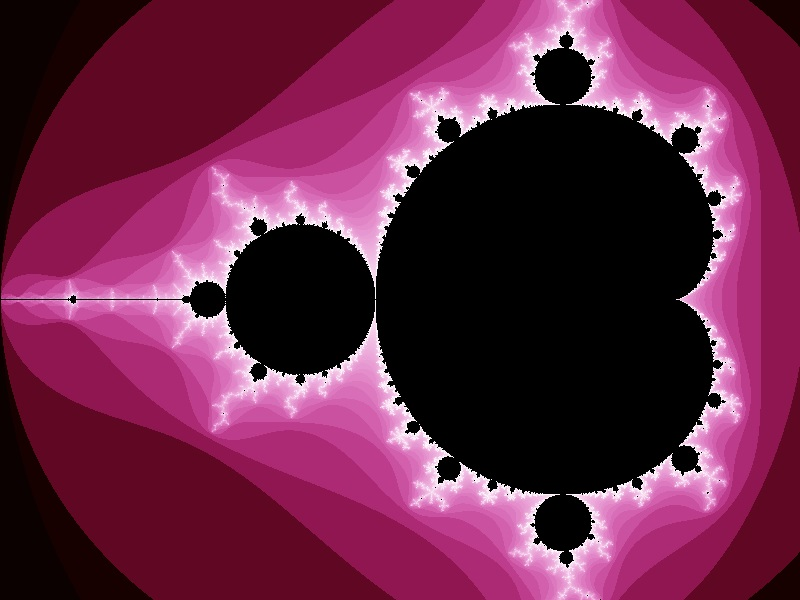

# Screenshots

29_09: Picture of a zoom into one of the branches of the fractal.   

 

21_09: Project build through PREMAKE has been implemented. We are also generating our first fractals images!   

  

20_09: The application engine, logger and timer are all set! We are also generating empty bitmatp images.  

  

 [Back](https://github.com/ManuCanedo/fractal-generator)
